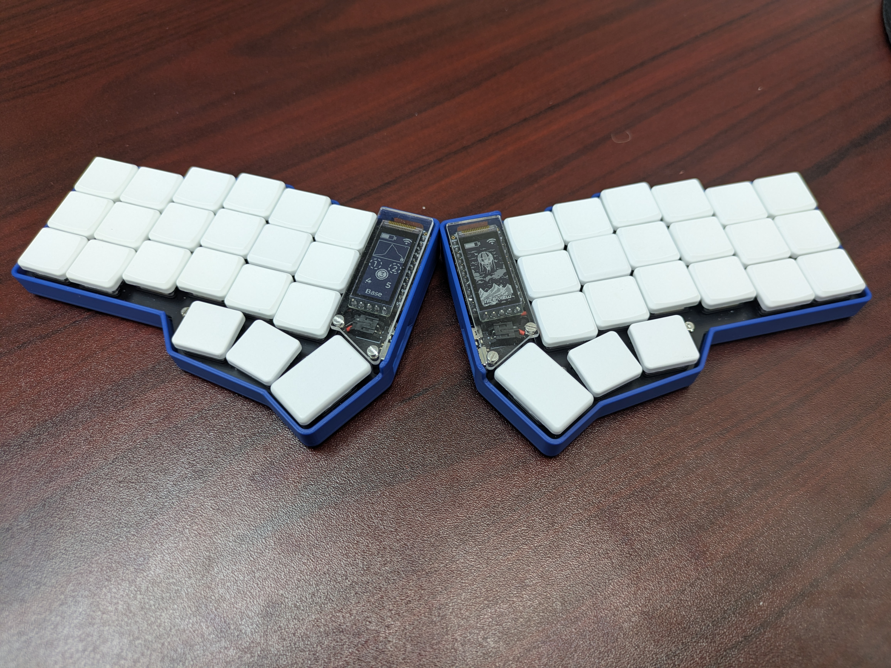
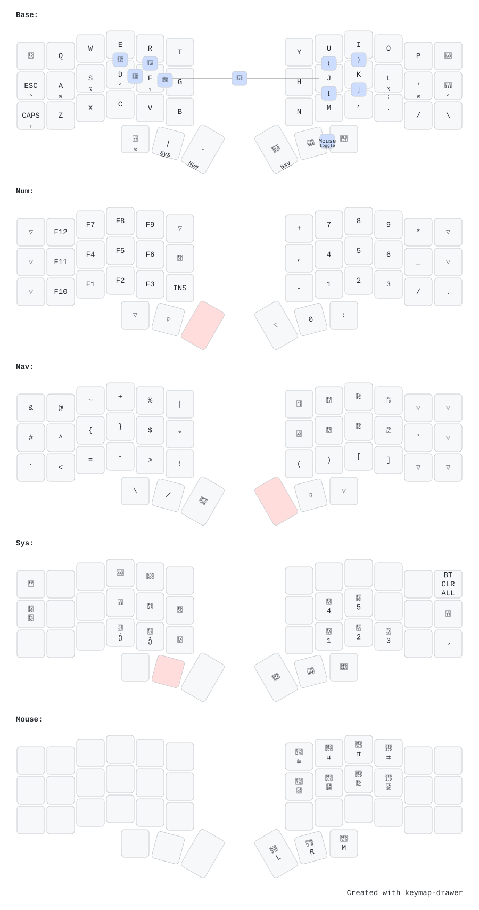
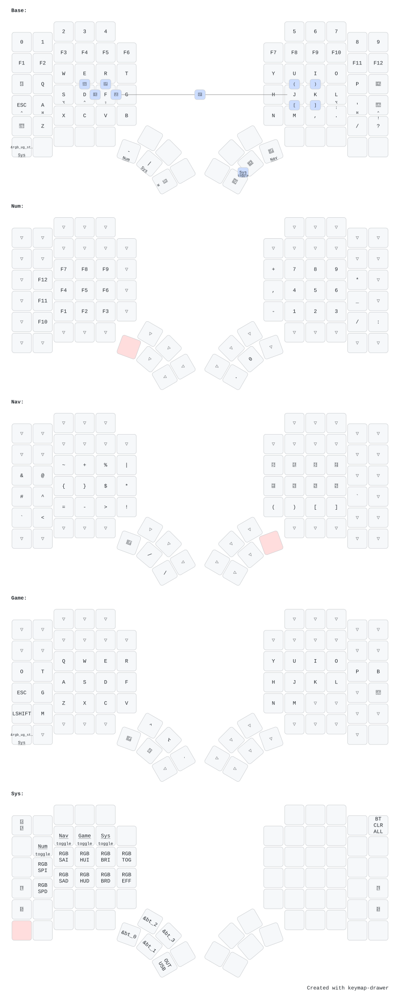

# ZMK config

## [Corne Wireless w/ View]([https://typeractive.xyz/](https://typeractive.xyz/pages/build?c=%257B%2522cases%2522%253A%2522blue-3dp%2522%252C%2522display_covers%2522%253A%2522clear-acrylic%2522%252C%2522batteries%2522%253A%2522110mah-3-7v-lipo%2522%252C%2522headers%2522%253A%2522ez-solder%2522%252C%2522microcontrollers%2522%253A%2522nice-nano%2522%252C%2522displays%2522%253A%2522nice-view%2522%252C%2522switches%2522%253A%2522kailh-choc-brown%2522%252C%2522keycaps%2522%253A%2522white-mbk-blanks%2522%257D&e=%255B%2522tenting-feet%2522%255D#corne_choc))

## [MoErgo Glove80](https://www.moergo.com/collections/glove80-keyboards)

# Credit

- [typeractive.xyz](https://typeractive.xyz/)
- [folke](https://github.com/folke/zmk-config)
